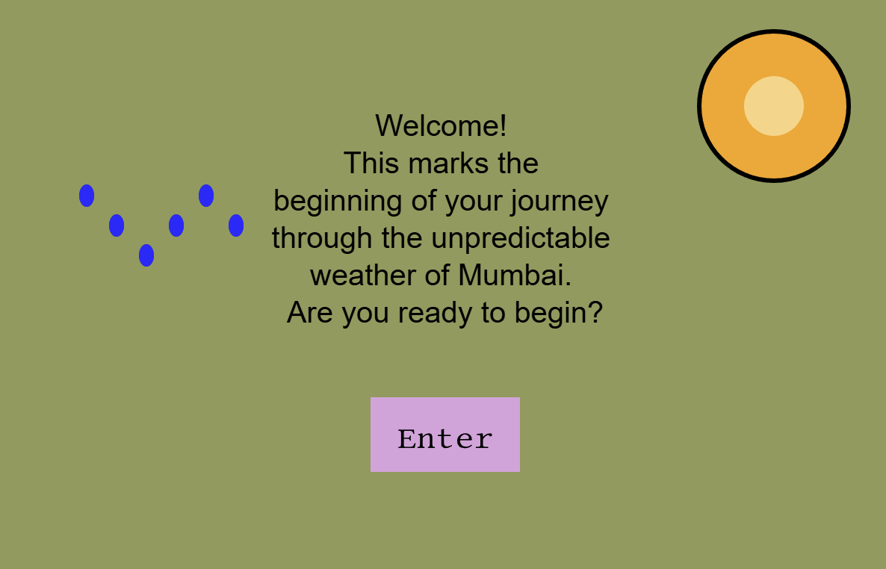

# 🌦️ CYOA-Game: Mumbai Weather Adventure

Welcome to the **Choose Your Own Adventure** game set in the unpredictable weather of Mumbai!
This interactive game allows users to make choices by pressing on-screen buttons and navigating through various weather scenarios in search of shelter.

---

## 🎮 How to Play

1. **Start the game** by clicking the **"Enter"** button.
2. You’ll encounter weather-related challenges (sun, rain).
3. Make decisions by clicking on one of the buttons labeled **“Shed”**, **“B1”**, or **“B2”**.
4. Each choice leads you down a different path. Some choices will lead you to shelter (a shed), others will not.
5. Find the right path to successfully escape the weather!

---

## 🛠️ Features

* Multiple screens and decision points
* Custom weather visuals (sun and rain)
* Interactive buttons using **p5play Sprites**
* Font customization for a polished look
* Dynamic background changes based on player choices

---

## 🧠 Game Logic Flow

```
Start ➡️ Sunny Screen ➡️ Choose a Shed:
               ↳ A1 ➡️ Rain Screen ➡️ B1 or B2
                       ↳ B1 or B2 = Shed (Win)
               ↳ A2 = Shed (Win)
```

---

## 📁 File Structure

```
/assets
  └── Lib.ttf         # Custom font used in the game

CYOA-Game.pde         # Main game code
README.md             # This file
```

---

## 📦 Dependencies

* [p5.js](https://p5js.org/)
* [p5play](https://p5play.org/) (for buttons using Sprite objects)

Make sure to include both libraries in your HTML file or Replit project settings.

---

## ✅ Customization Ideas For Future

* Add more branching paths for deeper gameplay
* Include sound effects for button clicks or weather
* Track and display the player's decision history
* Add animations for weather changes

---

## 💡 Learnings

This game has been a great beginner project to:

* Learn conditional logic
* Practice using **p5.js** and **p5play**
* Experiment with user interaction and graphics

---

## 📸 Preview



---

## 🔄 License

MIT License. Free to use, modify, and share with attribution.
